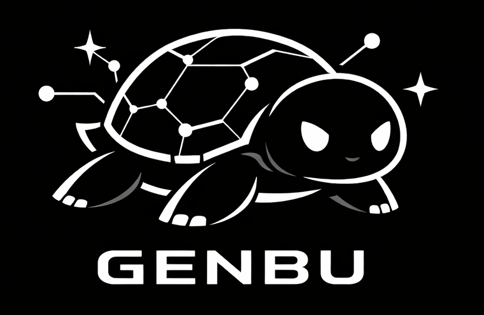

# Genbu

Genbu is my personal ROS development platform built on the iRobot Create 2.

Named after the Black Tortoise of Chinese myth, an homage to turtlebot, Genbu represents endurance and longevity and in some folklore the virtue of knowledge, perfect for a platform to learn robotics!

## Packages

| Package | Description |
|---------|-------------|
| genbu_bringup | Launch files and configuration for bringing up the robot |
| genbu_control | Control nodes for the robot |
| genbu_description | URDF robot description |
| genbu_simulator | Gazebo simulation environment |
| genbu_web | Web applications for the robot (Foxglove bridge) |
